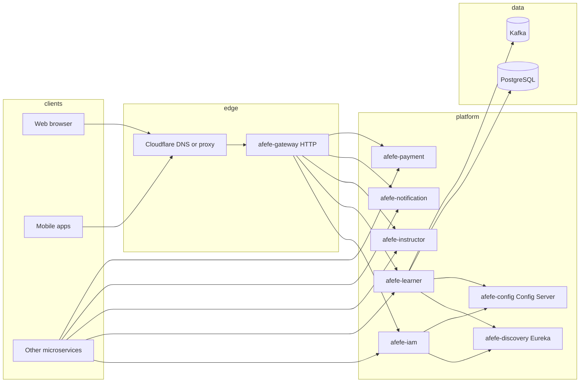

# System architecture

## Public edge (documented intent)

Traffic for **`https://afefe.com`** is expected to pass through **Cloudflare** (DNS and typically HTTP/S proxy features). The **origin** today is **Contabo VPS**; **production** is **planned on GCP** (not live yet). See [10-environments-compliance-clients.md](./10-environments-compliance-clients.md).

## High-level flow

**Inter-service traffic** (gRPC/HTTP/messaging between microservices) does not always traverse the public gateway; map actual call graphs from code and network policy, especially for production on **GCP** (private networking, mTLS, or service mesh).

## Configuration and discovery

- **Spring Cloud Config** (`afefe-config`): services import `configserver:http://{host}:1001` and load layered files such as `common` + service-specific (`learner`, `iam`, `gateway`, etc.) for the active profile (`staging`, `production`, …).
- **Eureka** (`afefe-discovery`, port **1000**): clients register and resolve service instances using `SPRING_CLOUD_CONFIG_URI` as hostname in many `application.yml` files.

## API styles

- **HTTP:** Exposed primarily through **afefe-gateway** (reactive), with path prefixes such as `/iam/**`, `/learner/**`, `/instructor/**`, `/notification/**`, `/payment/**` (see gateway `application.yml`).
- **gRPC:** Backend services expose **gRPC on ports 2003–2007** (parallel to HTTP ports 1003–1007). The shared security model in `afefe-entities` applies **global server interceptors** for channel credentials and JWT/tenant resolution on gRPC calls.
- **Web / mobile:** Clients attach **Bearer** tokens and optional **Channel-ID / Channel-Secret** headers (see `afefe-frontend` patterns; mobile equivalents should follow the same API contracts).
- **Inter-service:** Backend-to-backend calls should be authenticated and authorized explicitly (not only “inside the VPC”) — critical for GCP production design.

## Trust boundaries (summary)

| Boundary | Mechanism to verify |
|----------|---------------------|
| Internet → Cloudflare → Origin | DNS, SSL mode, WAF/bot rules, origin IP allowlists when applicable |
| Internet → Gateway | Authentication at backend; rate limits |
| Gateway → services | Internal network; often HTTP to localhost/host — confirm TLS/mTLS for production (especially **GCP**) |
| Service ↔ Service | mTLS, network policies, or mesh; never trust “private IP” alone |
| Service → PostgreSQL | JDBC URLs and credentials from config; TLS to DB if required |
| Service → Kafka | Bootstrap servers from config; SASL/TLS if required |
| Webhooks (e.g. Stripe) | Signature verification on payment service HTTP endpoints |
